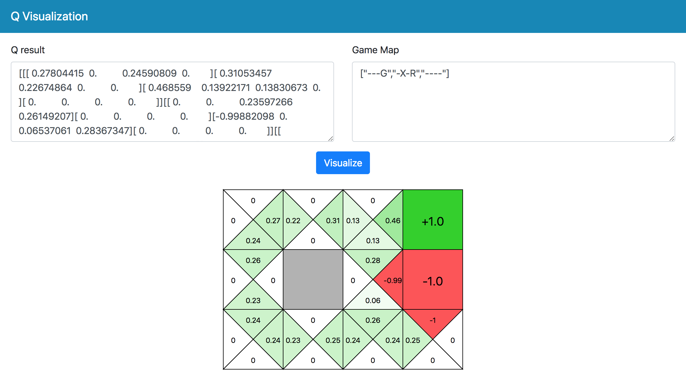

🎲🌟 Q Visualization
===



Q Visualization is app-based application to visualize messy output from running `q-learning` algorithm which [public in Gist](https://gist.github.com/neungkl/7c86bffc82b09bd48f06750e1c86bf63).

This project is related to Medium article (Thai language) about how to implement Q-learning to solves maze problem.

- Solving maze problem with Q-learning algorithm [https://medium.com/kosate/bb23a25dd448](https://medium.com/kosate/bb23a25dd448)

Try online interaction

👉 [https://neungkl.github.io/Q-visualization/](https://neungkl.github.io/Q-visualization/)


# Q-learning Algorithm

This is the original source code which implemented Q-learning alhorithm.

```python
import numpy as np
import collections

GRID_WIDTH = 4
GRID_HEIGHT = 3

ACTION_SIZE = 4

grid_world = np.array([
  "---G",
  "-X-R",
  "----"
])

Q = np.zeros((GRID_HEIGHT, GRID_WIDTH, ACTION_SIZE))

action_dir = np.array([
  [0,1],  # Left
  [0,-1], # Right
  [1,0],  # Down
  [-1,0]  # Up
])

def is_correct_move(x, y, a):
  new_y = y + action_dir[a][0]
  new_x = x + action_dir[a][1]
  if new_x < 0 or new_x >= GRID_WIDTH or new_y < 0 or new_y >= GRID_HEIGHT:
    return False
  return grid_world[new_y][new_x] != 'X'

def is_end_game(x, y):
  return grid_world[y][x] != '-'

def select_move(x, y):
  action_order = np.argsort(Q[y][x])
  for a in action_order:
    if is_correct_move(x, y, a):
      return a, x + action_dir[a][1], y + action_dir[a][0]

def random_move(x, y):
  action_order = np.arange(ACTION_SIZE)
  np.random.shuffle(action_order)
  for a in action_order:
    if is_correct_move(x, y, a):
      return a, x + action_dir[a][1], y + action_dir[a][0]

def calculate_reward(x, y):
  if grid_world[y][x] == '-':
    return -0.01
  elif grid_world[y][x] == 'G':
    return 1.0
  return -1.0

explore_rate = 1.0
explore_rate_stop = 0.1
explore_rate_decay = 0.99

learning_rate = 0.1
discount_factor = 0.99

for update_t in range(1000):
  state_x = 0
  state_y = GRID_HEIGHT - 1

  while not is_end_game(state_x, state_y):
    if np.random.rand() > explore_rate:
      action, new_x, new_y = select_move(state_x, state_y)
    else:
      action, new_x, new_y = random_move(state_x, state_y)

    reward = calculate_reward(new_x, new_y)

    Q[state_y][state_x][action] = (1 - learning_rate) * Q[state_y][state_x][action] \
      + learning_rate * (reward + discount_factor * np.max(Q[new_y][new_x]))
    
    state_x = new_x
    state_y = new_y

  explore_rate *= explore_rate_decay
  if explore_rate < explore_rate_stop:
    explore_rate = explore_rate_stop

print(Q)
```

You can run this code by entering these commands

```sh
python q-learning.py
```

And it will produced output in following format

```
[[[ 0.34970776  0.          0.3208027   0.        ]
  [ 0.42738484  0.24631195  0.          0.        ]
  [ 0.65132156  0.15723554  0.15966534  0.        ]
  [ 0.          0.          0.          0.        ]]

 [[ 0.          0.          0.3089113   0.33558951]
  [ 0.          0.          0.          0.        ]
  [-0.99778147  0.          0.12897659  0.36803105]
  [ 0.          0.          0.          0.        ]]

 [[ 0.32214568  0.          0.          0.3221908 ]
  [ 0.33550436  0.30896627  0.          0.        ]
  [ 0.31682213  0.31713143  0.          0.34902606]
  [ 0.          0.3304106   0.         -1.        ]]]
```

And you can convert these format to nice via Q visualizer by enter output to `Q result` (in website) and enter the grid game configuration (See the code above) to `Game Map`

Click `Visualize` and then the website will automatic generate nicely graphic to you.


# License

[MIT](LICENSE) © Kosate Limpongsa

